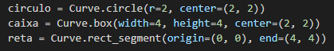
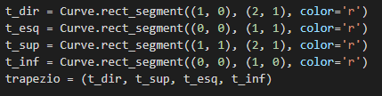
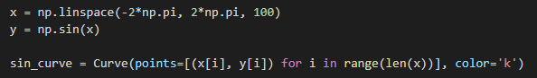
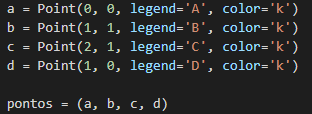
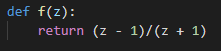
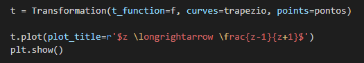
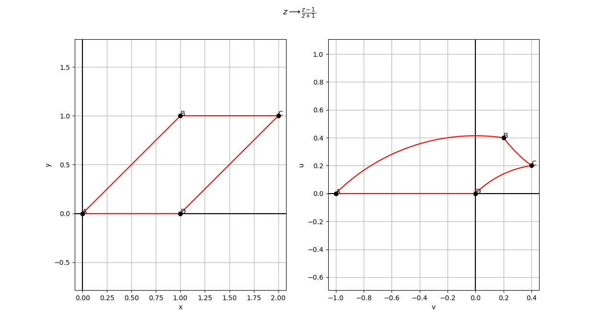

# Algoritmo para visualização de transformações de funções complexas

## Modo de Uso

1) Para utilizar os algoritmos, você deve importar as classes **Transformation**, **Curve** e **Point**;

2) A seguir, defina as curvas que você deseja transformar. Existem curvas predefinidas que podem ser utilizadas: `Curve.circle(r, center, color)`, `Curve.box(width, height, center, color)` e `Curve.rect_segment(origin, end, color)`;

3) Também é possível compor curvas para formar alguma forma geométrica, como um paralelogramo:

3) Também é possível utilizar curvas que você mesmo pode implementar;

4) Para auxiliar a visualização é possível adicionar pontos de legenda nas curvas. Para isto, basta utilizar a classe **Point**. Por exemplo, definindo 4 pontos nos vértices do paralelograma que definimos antes:

5) Depois, você deve definir a função de transformação. Esta função deve ser uma função de **z**, onde z é complexo. Por exemplo:

6) Feito isto, basta realizar a transformação e plotar:

### Resultado

